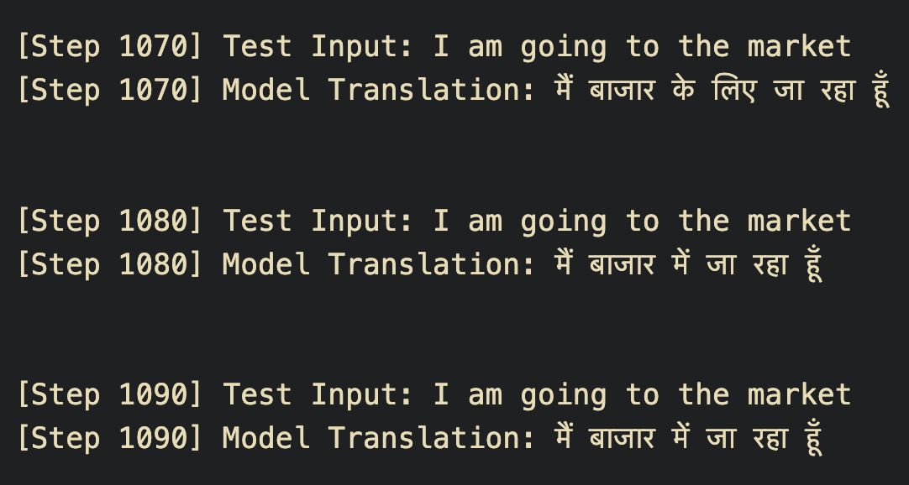

# 🌐 English → Hindi Neural Machine Translation
### Fine-tuning Facebook's mBART-50 with LoRA for English-to-Hindi Translation

---

## 📌 Overview

This project fine-tunes **Facebook's `mbart-large-50`** model for **English-to-Hindi translation** using the HuggingFace `Seq2SeqTrainer` API with **LoRA (Low-Rank Adaptation)** for parameter-efficient training. The model was trained on a large parallel corpus sourced from Kaggle and monitored via TensorBoard.

---

## 🧠 Model Background

### What is mBART?

mBART (Multilingual BART) is a sequence-to-sequence transformer model developed by Facebook AI, pre-trained using a **Multilingual Denoising Pretraining** objective. In this approach, the model is given corrupted (noised) versions of text across multiple languages and trained to reconstruct the original — learning shared representations across languages in the process.

The original **mBART** (`mbart-large-cc25`) was trained on 25 languages. **mBART-50** extended this to 50 languages by continuing pre-training on an additional 25 language corpora, making it one of the most widely used multilingual Seq2Seq models. The architecture is a standard Transformer encoder-decoder with 12 layers each, a hidden dimension of 1024, and 16 attention heads — about 600M parameters in total.

A key design decision in mBART is the use of **language ID tokens** as prefixes. The source text is formatted as `[lang_code] X [eos]` and the target output is steered by forcing the target language ID as the first generated token via `forced_bos_token_id`. This is what makes it easily adaptable for any translation direction among its 50 supported languages.

> **What's notable about mBART-50:** Unlike models that are just pretrained and then fine-tuned on a single translation pair, mBART-50 was shown to benefit from *multilingual fine-tuning* — training on many translation directions simultaneously — which improved zero-shot and low-resource translation significantly.

---

### What is IndicBART?

IndicBART is a multilingual Seq2Seq model developed by **AI4Bharat**, specifically designed for Indian languages. It is built on the same mBART architecture but trained exclusively on **IndicCorp** — a large corpus of 452 million sentences and 9 billion tokens spanning 11 Indian languages (Assamese, Bengali, Gujarati, Hindi, Kannada, Malayalam, Marathi, Odia, Punjabi, Tamil, Telugu) and English.

One of IndicBART's most distinctive design choices is that **all Indic languages are represented in the Devanagari script** during training. The idea is that since many Indian languages are structurally related, collapsing them into a shared script encourages cross-lingual transfer — the model can more easily generalize what it learns in Hindi to Marathi or Bengali, for instance.

IndicBART is also considerably **smaller and cheaper** than mBART-50 or mT5-base, making it more practical to fine-tune on limited compute.

> **What's notable about IndicBART:** It fills a gap left by mBART-50, which doesn't cover languages like Assamese, Odia, or Punjabi. By focusing entirely on the Indic language family with a Devanagari-unified vocabulary, IndicBART is purpose-built for South Asian NLP tasks.

---

### Why mBART Won Out in This Project

Despite IndicBART being the more "purpose-built" option for Hindi, its tokenizer turned out to be a poor fit for this use case. IndicBART uses a custom `AlbertTokenizer` with a specific input format (`Sentence </s> <2en>`) and requires Devanagari script conversion for non-Hindi languages — adding friction and introducing tokenization mismatches on this dataset. mBART-50's `MBart50TokenizerFast` handled both English and Hindi cleanly out of the box, making it the more practical choice for this fine-tuning setup.

---

## 📂 Dataset

- **Source:** [Hindi-English Parallel Corpus – Kaggle](https://www.kaggle.com/datasets/vaibhavkumar11/hindi-english-parallel-corpus)
- **Total rows in dataset:** ~15.6 lakh (1,561,841 rows)
- **Subset used for training:** 50,000 rows (rows 1,023,456 → 1,073,456)
- **Format:** CSV with two columns — `hindi` and `english`

---

## 🔬 Model & Tokenizer

| Component | Detail |
|-----------|--------|
| **Base Model** | `facebook/mbart-large-50` |
| **Tokenizer** | `MBart50TokenizerFast` |
| **Source Language** | `en_XX` |
| **Target Language** | `hi_IN` |

### Why mBART over IndicBART?

IndicBART and its variants were explored first, but their tokenizers did not perform well on this dataset — producing poor or misaligned token outputs for Hindi text. `mbart-large-50`'s multilingual tokenizer handled both English and Hindi cleanly and was ultimately the right choice.

> **Note:** At the start of training, the untrained model was returning English output for English input (no translation happening). This was resolved by correctly configuring the `forced_bos_token_id` to `hi_IN` and setting the source/target language codes properly in the tokenizer.

---

## 🧹 Preprocessing Pipeline

The following preprocessing steps were applied before tokenization:

1. **Lowercase** all English text
2. **Remove null rows** (418 null Hindi rows were found and dropped)
3. **Detect and filter mismatched language rows** — checked if Hindi column accidentally contained English text
4. **Regex cleaning** — removed special characters like `@`, `#`, `$`, `%`, and other unnecessary punctuation (kept `। ? ! .`)
5. **Hindi numeral conversion** — converted Devanagari numerals (०-९) to Arabic numerals (0-9)
6. **Unicode Normalization** — applied `NFKC` normalization via `unicodedata.normalize`
7. **Whitespace cleanup** — stripped leading/trailing spaces and collapsed multiple spaces

---

## 📏 Max Token Length Strategy

Rather than using an arbitrary fixed max length, the 95th percentile of token length across **all sentences** in the training set was computed and used as `max_length`. This keeps the padding overhead low while covering the vast majority of real-world sentence lengths without truncating meaningful content.

---

## ⚙️ LoRA Configuration

[PEFT](https://github.com/huggingface/peft) was used to apply LoRA adapters to the model for memory-efficient fine-tuning:

```python
LoraConfig(
    task_type=TaskType.SEQ_2_SEQ_LM,
    r=...,
    lora_alpha=...,
    lora_dropout=...,
    target_modules=[...]
)
```

The model was wrapped using `get_peft_model()` before passing to the trainer.

---

## 🏋️ Training Setup

Training was handled by HuggingFace's `Seq2SeqTrainer` with the following setup:

- **Trainer:** `Seq2SeqTrainer`
- **Arguments:** `Seq2SeqTrainingArguments`
- **Data Collator:** `DataCollatorForSeq2Seq`
- **Logging:** TensorBoard (`tensorboard`, `tensorboardX`)
- **Custom Callbacks:** `TrainerCallback` used for additional logging/control during training

```python
Seq2SeqTrainingArguments(
    output_dir="./results",
    evaluation_strategy="epoch",
    logging_dir="./logs",
    report_to="tensorboard",
    predict_with_generate=True,
    ...
)
```

---

## 📊 TensorBoard Monitoring

Training metrics were tracked in real-time using TensorBoard. To launch:

```bash
tensorboard --logdir=./logs
```

### Output / Screenshots

> 📸 _Add TensorBoard training loss curve screenshot here_

> 📸 _Add TensorBoard eval loss / BLEU score screenshot here_

---

## 🧪 Sample Translations




---

## 📦 Requirements

```bash
pip install torch transformers datasets peft tensorboard tensorboardX kagglehub pandas numpy
```

---

## 🚀 How to Run

1. Clone the repo and open the notebook
2. Authenticate with Kaggle and download the dataset via `kagglehub`
3. Run all preprocessing cells in main.ipynb
4. Configure LoRA and Seq2SeqTrainer
5. Start training — monitor with TensorBoard

---

## 📁 Project Structure

```
.
├── notebook.ipynb        # Main training notebook
├── logs/                 # TensorBoard logs
├── results/              # Saved model checkpoints
└── README.md
```

---

## 🔭 Future Work

- Train on more rows (the full 15L dataset)
- Evaluate with BLEU score on a held-out test set
- Export and serve the fine-tuned LoRA adapter
- Compare with IndicBART after fixing tokenizer issues

---

## 📜 References

- [mBART paper – Lewis et al., 2020](https://arxiv.org/abs/2001.08210)
- [HuggingFace mbart-large-50](https://huggingface.co/facebook/mbart-large-50)
- [PEFT / LoRA](https://github.com/huggingface/peft)
- [Kaggle Dataset](https://www.kaggle.com/datasets/vaibhavkumar11/hindi-english-parallel-corpus)
